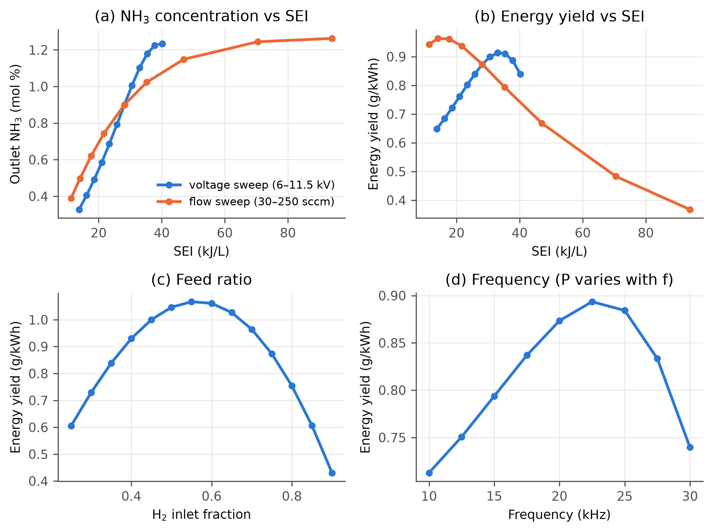
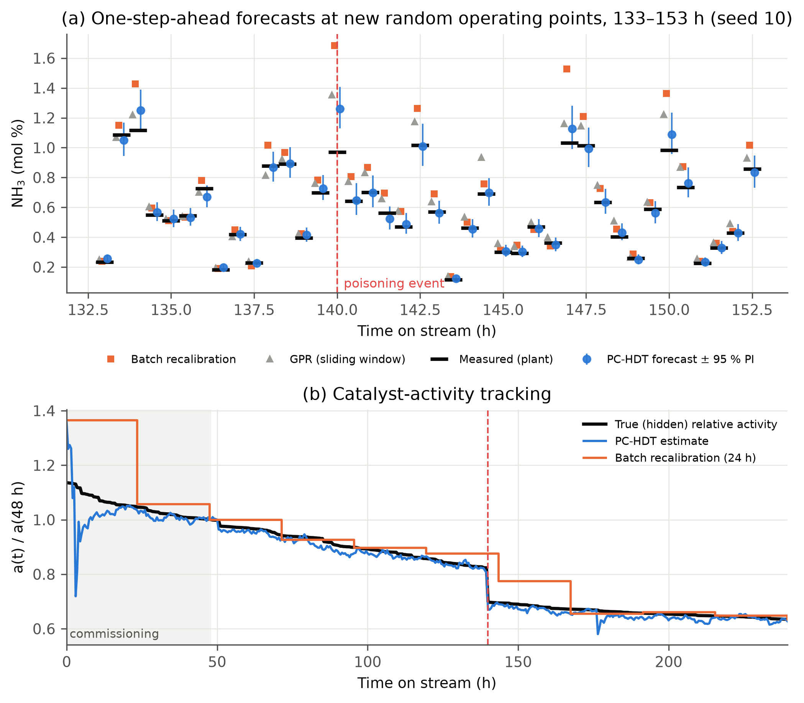
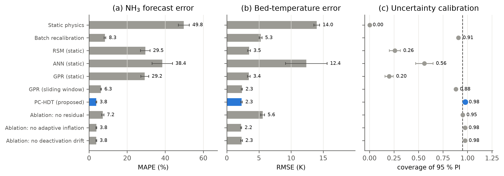
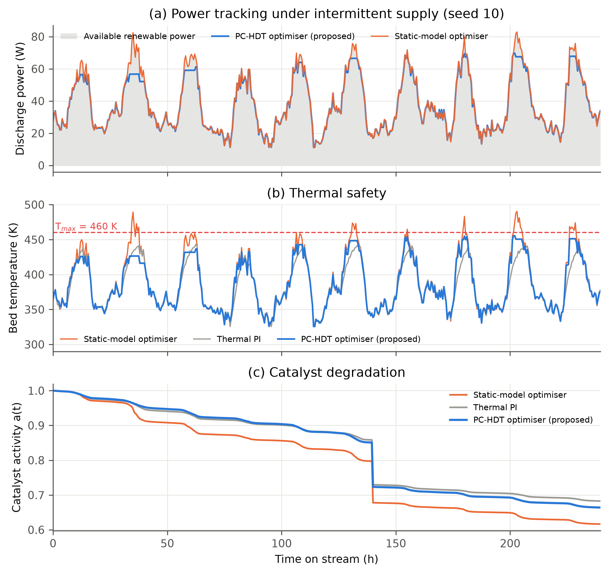
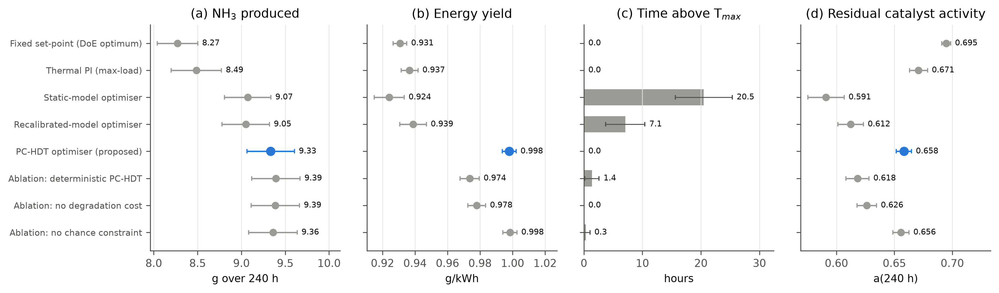
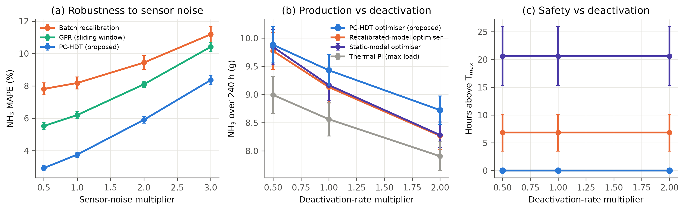

# A Physics-Constrained Hybrid Digital Twin with Risk- and Degradation-Aware Optimisation for Renewable-Powered Plasma-Catalytic Ammonia Microreactors

*Research report — in-silico study. Repository: `Plasma-Catalyst-Microreactor-Digital-Twin`.*

> **Scope and honesty statement.** The Google AI Studio app referenced as "the work"
> could not be opened from the analysis environment (it's a private, login-protected
> app and outbound access was refused), and the GitHub repository was empty. The study
> below was therefore built from the project title: a digital twin for a
> plasma-catalyst microreactor. All "readings and measurements" are **simulated**:
> they come from a high-fidelity virtual plant that is deliberately *different* from
> the models inside the twins. None of them are laboratory data. Literature
> references should each be checked (DOI, volume, pages) before submission.

---

## 1. Background and problem statement

Non-thermal plasma catalysis couples a dielectric-barrier discharge (DBD) with a solid
catalyst packed in the discharge gap. Energetic electrons excite N₂ vibrationally and
electronically, which lowers the effective dissociative-adsorption barrier on the
catalyst and allows NH₃ synthesis near ambient pressure and temperature [1–4]. Because a
DBD switches on and off in microseconds, it is a natural candidate for **electrifying
chemical production with intermittent renewable power** [4,5]. Two practical obstacles
stand between laboratory DBD reactors and such operation:

1. **Low and fragile energy yield.** Typical DBD packed-bed NH₃ energy yields are
   ≈0.1–3 g/kWh, and NH₃ concentrations are a few thousand ppm [4,5,22,23]. The optimum
   window in specific energy input (SEI), feed ratio, frequency and bed temperature is
   narrow. NH₃ is destroyed again by electron impact and thermal-catalytic
   decomposition at high SEI and temperature.
2. **Drift.** Catalyst activity decays through sintering, nitridation and poisoning
   [19]. The dielectric and packing age, which shifts the burning voltage and so the
   power actually deposited at a given applied voltage [6,7]. The available
   renewable power changes every few minutes. An operating point that is optimal on
   day 1 is sub-optimal, or unsafe for the catalyst, on day 10.

A **digital twin (DT)**, meaning a virtual replica continuously synchronised with the
physical asset and used for decisions [13,14,27], is the natural tool. This study asks:

> *How should a real-time digital twin of a plasma-catalytic microreactor be built so
> that it (i) stays accurate while the reactor degrades, (ii) knows how uncertain it is,
> and (iii) can safely steer the reactor to maximise NH₃ output from fluctuating
> renewable power?*

## 2. Review of existing methods

| # | Family | Representative work | Strengths | Limitations for a real-time DT |
|---|---|---|---|---|
| M1 | Detailed plasma-chemistry kinetics (0-D/1-D, Boltzmann solver + hundreds of reactions + surface microkinetics) | ZDPlasKin/BOLSIG+ [8,9]; van 't Veer et al. [23]; Mehta et al. [2] | Mechanistic insight, extrapolation | Slow (minutes–hours per point); many uncertain rate constants; **never updated from process data**; no degradation |
| M2 | Lumped/reduced physics models (Manley power, global rate laws) | [6,7], reactor-engineering studies | Fast, interpretable | Structural mismatch (non-uniform filaments, T profiles); fixed parameters drift out of calibration |
| M3 | Design of experiments + response-surface methodology (RSM) | Widely used for DBD parameter optimisation | Simple, few runs | Static and local; no physics; no uncertainty; re-running a DoE for every drift is impractical |
| M4 | Machine-learning surrogates (ANN, SVR, GPR, RF), often with GA optimisation | Istadi & Amin [10]; many later ANN/GPR studies of plasma reforming and NH₃ | Captures nonlinearity | Data-hungry; trained once, so it **silently goes stale** as the catalyst degrades; poor extrapolation; ANN gives no calibrated uncertainty |
| M5 | Periodic offline re-calibration of a physics model | Standard industrial practice | Restores accuracy periodically | Blind between re-fits; the batch least-squares fit mixes structural error into parameters; no UQ; abrupt events go unseen until the next re-fit |
| M6 | Hybrid (grey-box) models | Psichogios & Ungar [17]; von Stosch et al. [18]; PINNs [15,16] | Physics + data | Usually trained offline; unconstrained residuals absorb physical effects (identifiability loss); rarely applied to plasma catalysis |
| M7 | Feedback control of DBD reactors (PI on power/temperature, fixed set-points) | Common lab practice | Robust, simple | Regulates a proxy variable and does not optimise NH₃ yield; blind to catalyst state |
| M8 | Sequential data assimilation (EnKF) and stochastic MPC | Evensen [11]; Anderson [30]; Mesbah [20]; Rawlings et al. [21] | Online state/parameter estimation with UQ; constraint handling under uncertainty | Mature in geoscience and process control but, to our knowledge, not yet combined with plasma-catalytic reactors |

## 3. Research gap

Across M1–M8 no published approach we are aware of simultaneously:

* **G1 – Online co-estimation of hidden degradation states.** Existing plasma-catalysis
  models treat catalyst activity and discharge electrical parameters as constants. None
  track them online from routine sensors (FTIR/MS NH₃, Lissajous power, bed
  thermometry).
* **G2 – Handling of structural model error without losing identifiability.** Data-driven
  corrections either replace the physics (M4) or absorb physical drifts into a black-box
  residual (M6), so a degradation indicator cannot be read from the twin.
* **G3 – Calibrated uncertainty.** Surrogates used in plasma catalysis rarely report
  whether their confidence intervals are reliable, yet catalyst-protecting temperature
  limits require exactly that.
* **G4 – Abrupt-event awareness.** Poisoning events and feed impurities change the
  process within minutes. Periodic re-calibration (M5) and fixed-gain filters react late.
* **G5 – Decision-making that prices catalyst life.** Existing optimisations maximise
  instantaneous conversion or energy yield and ignore that hot operation consumes
  catalyst activity that later production depends on.
* **G6 – Intermittent renewable power.** Model-based operation of plasma catalysis under
  a time-varying power budget has been discussed conceptually [4,5] but not demonstrated
  with a synchronised twin.

## 4. Proposed method: PC-HDT with risk- and degradation-aware optimisation

### 4.1 Architecture

```
   renewable power P_cap(t) ─────────────┐
                                          ▼
 ┌──────────── Physical reactor (here: high-fidelity virtual plant) ─────────────┐
 │ inputs u=[V, f, Q, x_H2]  →  sensors z=[ln y_NH3, ln P, T_bed]  (+ HW limiter) │
 └───────────────────────────────────────────────────────────────┬───────────────┘
                     ▲ u*                                          │ z_k
 ┌───────────────────┴─────────────┐     ┌────────────────────────▼───────────────────────────┐
 │ (C) Risk- & degradation-aware   │◄────│ PC-HDT twin                                        │
 │     optimiser (grid, ensemble)  │     │ (A) EnKF on θ=[ln a, ΔU_b, ln R_th] (fast)         │
 │  max E[ṁ] − μE[P] − E[ṁ·ȧ/a]·H  │     │     + physics-informed deactivation drift          │
 │  s.t. E[P] ≤ P_cap              │     │     + innovation(NIS)-triggered inflation (events) │
 │       Pr(T ≤ T_max) ≥ 95 %      │     │ (B) bias-free RLS residual on structural error     │
 └─────────────────────────────────┘     │     (slow time scale, forgetting λ = 0.995)        │
                                         │ (D) Mehra-type predictive-variance adaptation      │
                                         └────────────────────────────────────────────────────┘
```

### 4.2 Reduced physics core (inside the twin)

* Power (Manley [6]): `P = 4 f C_d U_b (V − (C_d+C_g)/C_d · U_b)`, with `U_b = U_b0 + ΔU_b`.
* Bed temperature: `T = T_w + R_th P / (1 + Q/Q_c)`.
* Lumped kinetics over residence time τ: `y = (G/D)(1 − e^{−Dτ})`, with
  `G = a k_pc e^{−E_pc/RT} (P/V_r)^γ x_N2 x_H2 + k_g (P/V_r) x_N2 x_H2` and
  `D = k_d P/V_r + a k_r e^{−E_r/RT}`.
* Nominal deactivation law (used for drift prediction and for pricing catalyst life):
  `ȧ = −k_s e^{−E_s/R(1/T − 1/T_ref)} (a − a_∞)²`.

### 4.3 Novel elements

1. **Two-time-scale hybrid estimation (addresses G1, G2).** A stochastic EnKF (64
   members) estimates the physically meaningful parameters θ quickly. A recursive
   least-squares residual `r(u) = Wᵀφ(u)` learns the input-dependent structural error
   slowly. φ contains **only centred, bias-free polynomial features** (no constant
   term), so a uniform level shift cannot be absorbed by the residual. It must be
   explained by catalyst activity. This keeps activity identifiable and readable as a
   health indicator.
2. **Physics-informed drift in the EnKF forecast step.** The ensemble for `ln a` is
   propagated with the nominal sintering law evaluated at each member's predicted
   temperature, so the prior anticipates deactivation instead of waiting for innovations.
3. **Innovation-triggered covariance inflation (G4).** If the normalised innovation
   squared `NIS = dᵀS⁻¹d` exceeds the χ²₃ 99 % quantile (11.34), parameter anomalies are
   inflated by `√min(NIS/3,16)` before the analysis. This is a statistically principled
   event detector.
4. **Calibrated predictive uncertainty (G3).** The predictive variance is
   `ensemble variance + sensor variance + representation error + s_k`, where `s_k` is
   adapted from innovation excess (Mehra-type [12]).
5. **Risk- and degradation-aware twin-in-the-loop optimisation (G5, G6).** At each
   30-min decision the whole ensemble is evaluated on a 3 220-point grid of
   `[V, f, Q, x_H2]`:
   * the objective `E[ṁ_NH3] − μ E[P] − E[ṁ_NH3·(−ȧ/a)]·H_rem` includes the value of the
     NH₃ that would be lost in the remaining horizon `H_rem` through catalyst consumed now
     (μ = 0.2 g/kWh marginal energy value);
   * the **safety state** (bed temperature) gets a chance constraint
     `Q₉₅(T) + 1.645σ_model ≤ T_max`. Sensor noise is excluded because the limit acts on
     the true temperature;
   * the **power** budget uses the expectation, because the supply's hardware limiter
     makes over-prediction self-correcting and safe (it only curtails).

## 5. Experimental set-up

### 5.1 Virtual plant (the "physical" reactor)

A coaxial packed-bed DBD microreactor (discharge volume 1 cm³, bed void fraction 0.4,
C_d = 40 pF, C_g = 10 pF, U_b0 = 2.5 kV), N₂/H₂ feed at 1 atm, wall at 300 K, is
simulated with 40 axial plug-flow cells. It contains physics the twins do **not** have:

| Plant feature (hidden from twins) | Twin assumption |
|---|---|
| Axially decaying filament density `∝ e^{−1.2z}` and sinusoidal T profile | uniform power, uniform T |
| H₂ order 1.5 in the surface route | order 1 |
| Frequency-dependent vibrational efficiency `(f/20 kHz)^−0.15` | none |
| Composition-dependent burning voltage `U_b(1+0.3(0.75−x_H2))` | constant `U_b` |
| H₂-enhanced heat removal | none |
| Hot-spot sintering (T_max of profile, 60 kJ/mol), plasma nitridation `∝ P/V` | bed-mean T, no nitridation |
| U_b ageing +0.04 %/h | unknown drift |
| **Unannounced poisoning at 140 h (activity × 0.85)** | unknown |

Sensors: NH₃ mole fraction ±3 % (1σ, relative; FTIR/MS), discharge power ±2 % (Lissajous),
bed temperature ±2 K (fibre-optic). The power supply clamps V so that P ≤ P_cap.
A 240-h campaign is simulated with a 30-min sampling/decision interval (480 steps).

### 5.2 Experiments

| ID | Purpose | Protocol | Readings / measurements |
|---|---|---|---|
| **E1** | Reactor characterisation | One-factor sweeps around V = 9 kV, f = 20 kHz, Q = 100 sccm, x_H2 = 0.75 (fresh catalyst) | P, SEI, T_bed, T_hot, NH₃ mol %, N₂ conversion, NH₃ g/h, energy yield g/kWh, τ |
| **E2** | Twin fidelity | Random space-filling DoE (V 6.5–11 kV, f 10–25 kHz, Q 40–200 sccm log-uniform, x_H2 0.5–0.85), new point every 30 min; each twin forecasts the next measurement **before** seeing it | MAPE/RMSE/R² of NH₃, post-event MAPE, 95 % PI coverage (PICP) and width, RMSE of P and T, relative-activity tracking error, update time |
| **E3** | Closed-loop operation | Renewable budget P_cap(t) = PV diurnal (cloud-modulated) + AR(1) wind + base, 10–85 W; T_max = 460 K | NH₃ produced, energy used, energy yield, renewable utilisation, hours above T_max, peak T, final activity, limiter events, decision time |
| **E4a** | Noise robustness | E2 with sensor noise ×0.5, 1, 2, 3 (10 seeds) | NH₃ MAPE, PICP |
| **E4b** | Degradation severity | E3 with deactivation rates ×0.5, 1, 2 (10 seeds) | NH₃ produced, violations, final activity |

**Statistical protocol.** Seeds 0–9 were used only for design and debugging. All reported
results use 20 held-out seeds (10–29), and each seed changes the DoE sequence, sensor
noise, power profile and EnKF/ANN initialisation. Results are mean ± SD across seeds.
Proposed-vs-baseline differences use the two-sided paired Wilcoxon signed-rank test [29].
E2 metrics are computed after the 48-h commissioning window (steps 96–479) so that the
static ML models, which are trained on the first 96 samples, are evaluated out of sample.

**Baselines.** E2: static physics (M2), batch re-calibration every 24 h on the last 24 h (M5),
quadratic RSM, ANN (2×32, ReLU, L2 = 1e-3) and GPR (ARD-RBF + white noise) trained once on
the 48-h commissioning DoE (M3/M4), and a sliding-window GPR re-trained on the last 96
samples (an adaptive data-driven twin). E3: fixed DoE optimum (M3), thermal PI "max-load"
control (M7), and the same grid optimiser driven by the static or the batch-recalibrated
model. Ablations remove each PC-HDT component in turn.

## 6. Results

All numbers are mean ± SD over 20 held-out seeds. Raw per-seed readings are in
`results/*.csv`, and statistical tests are in `results/E2_wilcoxon.csv` and
`results/E3_wilcoxon.csv`.

### 6.1 E1 – Reactor characterisation (virtual-plant readings, fresh catalyst)



*Fig. 1 – Characterisation of the virtual plant (full table: `results/E1_characterisation_readings.csv`).*

Selected readings (base point V = 9 kV, f = 20 kHz, Q = 100 sccm, x_H2 = 0.75):

| Sweep point | P (W) | SEI (kJ/L) | T_bed (K) | NH₃ (mol %) | X_N₂ (%) | NH₃ (g/h) | EY (g/kWh) |
|---|---|---|---|---|---|---|---|
| V = 6.0 kV | 23.0 | 13.8 | 358.9 | 0.33 | 0.65 | 0.015 | 0.65 |
| V = 9.0 kV (base) | 47.0 | 28.2 | 420.3 | 0.90 | 1.80 | 0.041 | 0.87 |
| V = 10.0 kV | 55.0 | 33.0 | 440.8 | 1.10 | 2.20 | 0.050 | **0.91** (V-optimum) |
| V = 11.5 kV | 67.0 | 40.2 | 471.5 | 1.23 | 2.47 | 0.056 | 0.84 |
| Q = 30 sccm | 47.0 | 94.0 | 439.9 | 1.26 | 2.53 | 0.017 | 0.37 |
| Q = 200 sccm | 47.0 | 14.1 | 400.3 | 0.50 | 0.99 | 0.045 | 0.96 |
| x_H2 = 0.55 | 48.2 | 28.9 | 430.9 | 1.13 | 1.25 | 0.051 | **1.07** (ratio optimum) |
| x_H2 = 0.90 | 46.0 | 27.6 | 412.4 | 0.43 | 2.17 | 0.020 | 0.43 |
| f = 22.5 kHz | 52.9 | 31.7 | 435.4 | 1.04 | 2.07 | 0.047 | **0.89** (f-optimum) |

The virtual plant reproduces the qualitative behaviour reported for DBD NH₃ synthesis:
concentrations below 1.5 mol %, energy yields near 1 g/kWh, NH₃ saturation and falling
energy yield at high SEI (electron-impact and thermal decomposition), and an optimum in
N₂-rich feed. Each operating variable shows an interior optimum, which is what makes
online optimisation worthwhile.

### 6.2 E2 – Digital-twin fidelity

| Method | NH₃ MAPE (%) | NH₃ RMSE (ppm) | R² | MAPE after event (%) | PICP₉₅ | RMSE P (W) | RMSE T (K) | Rel.-activity RMSE | Update (ms) |
|---|---|---|---|---|---|---|---|---|---|
| Static physics | 49.8 ± 2.9 | 3909 ± 250 | −0.92 | 66.0 ± 3.3 | 0.00 | 1.84 | 14.0 | – | 0.002 |
| Batch recalibration | 8.34 ± 0.48 | 1120 ± 98 | 0.842 | 9.03 ± 0.72 | 0.91 | 1.06 | 5.26 | 0.049 | 0.08 |
| RSM (static) | 29.5 ± 2.5 | 1875 ± 220 | 0.555 | 43.4 ± 3.0 | 0.26 | 1.41 | 3.46 | – | 0.09 |
| ANN (static) | 38.4 ± 5.4 | 2980 ± 580 | −0.16 | 49.4 ± 5.7 | 0.56 | 9.76 | 12.4 | – | 5.8 |
| GPR (static) | 29.3 ± 2.1 | 1866 ± 150 | 0.562 | 43.2 ± 2.5 | 0.20 | 1.41 | 3.43 | – | 1.3 |
| GPR (sliding window) | 6.27 ± 0.20 | 510 ± 26 | 0.967 | 7.01 ± 0.31 | 0.88 | 0.97 | 2.35 | – | 50.8 |
| **PC-HDT (proposed)** | **3.78 ± 0.21** | **362 ± 29** | **0.984** | **3.91 ± 0.27** | **0.977** | **0.91** | **2.30** | **0.021** | 0.73 |
| – no residual | 7.21 ± 0.57 | 907 ± 87 | 0.896 | 7.17 ± 0.77 | 0.952 | 1.05 | 5.58 | 0.045 | 0.42 |
| – no adaptive inflation | 3.83 ± 0.21 | 351 ± 25 | 0.985 | 3.97 ± 0.27 | 0.976 | 0.91 | 2.22 | 0.021 | 0.56 |
| – no deactivation drift | 3.81 ± 0.21 | 365 ± 29 | 0.983 | 3.92 ± 0.27 | 0.976 | 0.91 | 2.30 | 0.021 | 0.45 |



*Fig. 2 – (a) Forecasts around the unannounced poisoning event. (b) Tracking of the hidden catalyst activity.*



*Fig. 3 – Twin benchmark over 20 seeds (mean ± SD).*

Key findings:

* **Accuracy.** PC-HDT reduces the NH₃ forecast error by **40 %** relative to the best
  existing adaptive twin (sliding-window GPR, 6.27 → 3.78 % MAPE), by **55 %** relative
  to periodic recalibration, and by **87 %** relative to one-off ML surrogates (RSM, ANN
  and GPR). All comparisons are significant at p = 1.9×10⁻⁶ (Wilcoxon, n = 20).
  Surrogates trained once lose accuracy as the catalyst ages: their error after the
  poisoning event rises to 43–49 %.
* **Uncertainty.** PC-HDT's 95 % intervals cover 97.7 % of measurements, against 88 %
  for sliding-window GPR and 20–56 % for the static ML models. The mean interval width is
  about the same as sliding-window GPR (0.238 vs 0.228 in ln units), so the better
  coverage comes from better calibration rather than wider intervals. The intervals are
  slightly conservative (97.7 % vs the nominal 95 %).
* **Health monitoring.** The relative catalyst activity is tracked with an RMSE of
  0.021, **57 % lower** than batch recalibration (0.049). The poisoning step is
  captured within one or two samples (Fig. 2b), whereas batch recalibration sees it
  only at the next 24-h re-fit.
* **Cost.** An update takes 0.73 ms, about 70× faster than the sliding-window GPR.
* **Ablation.** The bias-free residual is the most valuable component: removing it
  nearly doubles the NH₃ error (7.21 %) and more than doubles the temperature error.
  **The innovation-triggered inflation and the physics-informed drift gave no
  practically relevant gain in this scenario** (ΔMAPE ≤ 0.05 percentage points; the
  version without inflation even has 0.08 K lower temperature RMSE). The base EnKF with
  random-walk noise already tracks a 15 % activity drop within a few samples. These two
  components should either be justified on harder events (larger or faster drops,
  sensor faults) or dropped from the claimed contributions.

### 6.3 E3 – Closed-loop renewable-powered operation (T_max = 460 K)

| Controller | NH₃ (g / 240 h) | Energy (kWh) | EY (g/kWh) | Renewable use (%) | h above T_max | Peak T (K) | a(240 h) | Decision (ms) |
|---|---|---|---|---|---|---|---|---|
| Fixed set-point (DoE optimum) | 8.27 ± 0.23 | 8.89 | 0.931 | 90.3 | 0 | 420 | 0.695 | <0.01 |
| Thermal PI (max-load) | 8.49 ± 0.29 | 9.06 | 0.937 | 92.0 | 0 | 447 | 0.671 | 0.01 |
| Static-model optimiser | 9.07 ± 0.27 | 9.82 | 0.924 | 99.8 | **20.5 ± 4.9** | 493 | 0.591 | 0.42 |
| Recalibrated-model optimiser | 9.05 ± 0.27 | 9.64 | 0.939 | 98.0 | **7.1 ± 3.3** | 476 | 0.612 | 0.49 |
| **PC-HDT optimiser (proposed)** | **9.34 ± 0.27** | 9.35 | **0.998** | 95.0 | **0** | 455 | 0.658 | 28 |
| – deterministic (no chance, no degr.) | 9.39 ± 0.28 | 9.65 | 0.974 | 98.0 | 1.4 ± 1.2 | 462 | 0.618 | 24 |
| – no degradation cost | 9.39 ± 0.28 | 9.60 | 0.978 | 97.5 | 0 | 456 | 0.626 | 26 |
| – no chance constraint | 9.36 ± 0.28 | 9.38 | 0.998 | 95.3 | 0.3 ± 0.7 | 460 | 0.656 | 27 |



*Fig. 4 – Closed-loop trajectories, seed 10.*



*Fig. 5 – Control benchmark over 20 seeds. Error bars are the SD across seeds, which is
dominated by the different weather profiles. Paired differences are much tighter
(see the Wilcoxon table).*

Key findings:

* Compared with the existing model-based optimisers, the proposed controller produces
  **2.9–3.1 % more NH₃** and raises the energy yield by **6.3–8.0 %** (0.998 vs
  0.924–0.939 g/kWh). It has **zero hours above the catalyst temperature limit**,
  against 20.5 h and 7.1 h, and leaves **7.5–11.4 % more catalyst activity**. All four
  differences are significant (p ≤ 9×10⁻⁵).
* Compared with safe conventional operation (fixed DoE set-point and thermal PI), it
  produces **10.0–12.8 % more NH₃** with a **6.5–7.2 % higher energy yield**. Those two
  strategies keep slightly more catalyst activity (0.67–0.70 vs 0.66) because they run
  cooler and leave 8–10 % of the renewable power unused.
* **Trade-offs shown by the ablations.** The chance constraint removes the remaining
  1.4 h of limit violations of a deterministic twin optimiser at a cost of 0.6 % NH₃.
  The degradation-aware cost buys +2.0 % energy yield and +0.032 residual activity for
  −0.55 % NH₃. Within the 240-h horizon, the variant without degradation cost is
  therefore marginally more productive. The degradation term pays off only when
  production beyond the campaign horizon is valued.
* Each decision takes about 28 ms (64-member ensemble × 3 220-point grid), negligible
  against a 30-min decision interval.

### 6.4 E4 – Sensitivity



*Fig. 6 – Sensitivity to sensor noise (10 seeds) and to deactivation severity (10 seeds).*

| Sensor noise × | Batch recal. MAPE | Sliding GPR MAPE | **PC-HDT MAPE** | PC-HDT PICP₉₅ |
|---|---|---|---|---|
| 0.5 | 7.81 | 5.52 | **2.92** | 0.980 |
| 1 | 8.18 | 6.20 | **3.75** | 0.979 |
| 2 | 9.44 | 8.10 | **5.90** | 0.966 |
| 3 | 11.18 | 10.41 | **8.36** | 0.956 |

| Deactivation × | Thermal PI NH₃ (g) | Static-opt NH₃ | Recal-opt NH₃ | **PC-HDT NH₃** | PC-HDT gain vs best baseline |
|---|---|---|---|---|---|
| 0.5 | 8.99 | 9.84 | 9.77 | **9.88** | +0.4 % |
| 1 | 8.56 | 9.17 | 9.13 | **9.43** | +2.9 % |
| 2 | 7.91 | 8.28 | 8.27 | **8.72** | +5.3 % |

PC-HDT stays the most accurate twin at every noise level, and its intervals stay
calibrated (PICP 0.956 at 3× noise). **Its production advantage grows with the rate of
catalyst degradation**, which is the regime a twin is meant for. The static and
recalibrated optimisers violate the temperature limit for the same number of hours at
every deactivation rate. Their thermal decisions do not depend on catalyst activity:
bed temperature in both plant and model depends on power and heat removal only.

## 7. Contributions (for the manuscript)

1. An open, fully reproducible benchmark for plasma-catalytic reactor digital twins: a
   virtual DBD NH₃ plant with degradation, events, sensor noise and a renewable-power
   scenario, plus 7 baseline twins and 4 baseline controllers.
2. PC-HDT, a two-time-scale hybrid twin (EnKF on physical parameters + bias-free RLS
   residual) that preserves the physical meaning of catalyst activity while correcting
   structural error. It gives 40–55 % lower forecast error than adaptive data-driven and
   recalibrated physics twins, and calibrated 95 % intervals.
3. A risk- and degradation-aware twin-in-the-loop optimiser for intermittent renewable
   power. Compared with model-based optimisers it gives +3 % NH₃ and +6–8 % energy yield
   with zero thermal-limit violations, and its advantage grows with degradation severity.
4. Ablation evidence identifying which components matter (residual ≫ chance constraint >
   degradation cost; inflation and drift negligible here).

## 8. Limitations and threats to validity

* **No physical data.** The plant is a simulator built by the same authors as the twin.
  The authors chose which mismatches to include (Table §5.1), and the twin's kinetic
  constants equal the plant's apart from the listed structural differences. Real
  reactors have unmodelled effects (packing-dependent discharge modes, humidity,
  NH₃ adsorption memory, and FTIR/MS lag of seconds to minutes) that could reduce the
  gains.
* **Quasi-steady assumption.** Residence times (≈0.1–0.5 s) are much shorter than the
  30-min decision interval, but thermal transients of the bed (minutes) are not modelled.
* **Limited event set.** Only one poisoning event of fixed size was simulated, which is
  probably why event-triggered inflation showed no benefit.
* **Design seeds.** The chance-constraint formulation was refined on pilot seeds 0–2
  (sensor noise was removed from the constraint margin, and power was treated as a
  hard-limited quantity). The reported seeds 10–29 were not used for design.
* **Grid optimiser.** Exhaustive grid search is fine for 4 inputs but will not scale to
  multi-reactor or pulsed-waveform design spaces; gradient-based or Bayesian
  optimisation would be needed.
* **Literature ranges.** The plant was tuned to typical published magnitudes, not fitted
  to one data set.

## 9. Recommended next steps towards a Q1 publication

1. **Hardware validation.** Build a coaxial packed-bed DBD (for example Ni/Al₂O₃ or
   Co/Al₂O₃, 1–3 mm gap) with Lissajous power measurement, online FTIR, and a fibre-optic
   bed thermometer. Record a 48-h DoE, then a ≥ 200-h campaign with a programmable
   power budget (a recorded PV/wind profile scaled to the reactor), and repeat E2/E3
   against real data.
2. **Replace the virtual plant's kinetics** with a validated 0-D plasma-chemistry model
   (ZDPlasKin/BOLSIG+ with an N₂/H₂ surface mechanism) to strengthen the in-silico part.
3. **Stress the event detector** with larger and faster events (feed O₂/H₂O pulses,
   partial electrode failure, sensor drift) to test whether the NIS trigger earns its
   place.
4. **Longer horizons** (≥ 1 000 h) with catalyst regeneration decisions, where the
   degradation-aware objective should matter more.
5. Possible venues (Q1, in the scope of plasma catalysis, digital twins or process
   control): *Chemical Engineering Journal*, *Applied Energy*, *Energy Conversion and
   Management*, *Journal of Process Control*, *Computers & Chemical Engineering*,
   *Plasma Sources Science and Technology*, *ACS Sustainable Chem. & Eng.*
   Check the current quartile and scope of each before submission.
6. **Funding and IP.** The combination "real-time hybrid twin + degradation-aware,
   chance-constrained control of plasma-catalytic reactors under renewable supply"
   could be positioned for green-hydrogen and green-ammonia calls (for example national
   green-hydrogen-mission or DST/SERB-type programmes). A prior-art search is needed
   before drafting any patent claim on the bias-free-residual / EnKF architecture or the
   degradation-priced chance-constrained operation.

## 10. Reproducibility

```bash
pip install -r requirements.txt
python -m pytest -q tests
python experiments/run_experiments.py      # ≈16 min on 4 cores; writes results/
python experiments/make_figures.py         # writes figures/
```

The software versions and run metadata are in `results/run_metadata.json`.

## References

*(Please verify every entry, including DOI, volume and pages, before citing.)*

1. E. C. Neyts, K. (Ken) Ostrikov, M. K. Sunkara, A. Bogaerts, "Plasma catalysis: synergistic effects at the nanoscale," *Chem. Rev.* 115 (2015) 13408–13446.
2. P. Mehta, P. Barboun, F. A. Herrera, J. Kim, P. Rumbach, D. B. Go, J. C. Hicks, W. F. Schneider, "Overcoming ammonia synthesis scaling relations with plasma-enabled catalysis," *Nat. Catal.* 1 (2018) 269–275.
3. A. Bogaerts, E. C. Neyts, "Plasma technology: an emerging technology for energy storage," *ACS Energy Lett.* 3 (2018) 1013–1027.
4. K. H. R. Rouwenhorst, Y. Engelmann, K. van 't Veer, R. S. Postma, A. Bogaerts, L. Lefferts, "Plasma-driven catalysis: green ammonia synthesis with intermittent electricity," *Green Chem.* 22 (2020) 6258–6287.
5. A. Bogaerts et al., "The 2020 plasma catalysis roadmap," *J. Phys. D: Appl. Phys.* 53 (2020) 443001.
6. T. C. Manley, "The electric characteristics of the ozonator discharge," *Trans. Electrochem. Soc.* 84 (1943) 83–96.
7. U. Kogelschatz, "Dielectric-barrier discharges: their history, discharge physics, and industrial applications," *Plasma Chem. Plasma Process.* 23 (2003) 1–46.
8. S. Pancheshnyi, B. Eismann, G. J. M. Hagelaar, L. C. Pitchford, ZDPlasKin: Zero-Dimensional Plasma Kinetics solver (2008), www.zdplaskin.laplace.univ-tlse.fr.
9. G. J. M. Hagelaar, L. C. Pitchford, "Solving the Boltzmann equation to obtain electron transport coefficients and rate coefficients for fluid models," *Plasma Sources Sci. Technol.* 14 (2005) 722–733.
10. Istadi, N. A. S. Amin, "Hybrid artificial neural network–genetic algorithm technique for modeling and optimization of plasma reactor," *Ind. Eng. Chem. Res.* 45 (2006) 6655–6664.
11. G. Evensen, "Sequential data assimilation with a nonlinear quasi-geostrophic model using Monte Carlo methods to forecast error statistics," *J. Geophys. Res.* 99 (1994) 10143–10162.
12. R. K. Mehra, "On the identification of variances and adaptive Kalman filtering," *IEEE Trans. Autom. Control* 15 (1970) 175–184.
13. F. Tao, H. Zhang, A. Liu, A. Y. C. Nee, "Digital twin in industry: state-of-the-art," *IEEE Trans. Ind. Inform.* 15 (2019) 2405–2415.
14. W. Kritzinger, M. Karner, G. Traar, J. Henjes, W. Sihn, "Digital Twin in manufacturing: a categorical literature review and classification," *IFAC-PapersOnLine* 51 (2018) 1016–1022.
15. M. Raissi, P. Perdikaris, G. E. Karniadakis, "Physics-informed neural networks," *J. Comput. Phys.* 378 (2019) 686–707.
16. G. E. Karniadakis et al., "Physics-informed machine learning," *Nat. Rev. Phys.* 3 (2021) 422–440.
17. D. C. Psichogios, L. H. Ungar, "A hybrid neural network–first principles approach to process modeling," *AIChE J.* 38 (1992) 1499–1511.
18. M. von Stosch, R. Oliveira, J. Peres, S. Feyo de Azevedo, "Hybrid semi-parametric modeling in process systems engineering: past, present and future," *Comput. Chem. Eng.* 60 (2014) 86–101.
19. C. H. Bartholomew, "Mechanisms of catalyst deactivation," *Appl. Catal. A* 212 (2001) 17–60.
20. A. Mesbah, "Stochastic model predictive control: an overview and perspectives for future research," *IEEE Control Syst. Mag.* 36 (2016) 30–44.
21. J. B. Rawlings, D. Q. Mayne, M. M. Diehl, *Model Predictive Control: Theory, Computation, and Design*, 2nd ed., Nob Hill, 2017.
22. Y. Wang, M. Craven, X. Yu, J. Ding, P. Bryant, J. Huang, X. Tu, "Plasma-enhanced catalytic synthesis of ammonia over a Ni/Al₂O₃ catalyst at near-room temperature: insights into the importance of the catalyst surface on the reaction mechanism," *ACS Catal.* 9 (2019) 10780–10793.
23. K. van 't Veer, Y. Engelmann, F. Reniers, A. Bogaerts, "Plasma-catalytic ammonia synthesis in a DBD plasma: role of microdischarges and their afterglows," *J. Phys. Chem. C* 124 (2020) 22871–22883.
24. C. E. Rasmussen, C. K. I. Williams, *Gaussian Processes for Machine Learning*, MIT Press, 2006.
25. G. E. P. Box, K. B. Wilson, "On the experimental attainment of optimum conditions," *J. R. Stat. Soc. B* 13 (1951) 1–45.
26. L. Ljung, *System Identification: Theory for the User*, 2nd ed., Prentice Hall, 1999.
27. M. Grieves, J. Vickers, "Digital twin: mitigating unpredictable, undesirable emergent behavior in complex systems," in *Transdisciplinary Perspectives on Complex Systems*, Springer, 2017, 85–113.
28. F. Pedregosa et al., "Scikit-learn: machine learning in Python," *J. Mach. Learn. Res.* 12 (2011) 2825–2830.
29. F. Wilcoxon, "Individual comparisons by ranking methods," *Biometrics Bull.* 1 (1945) 80–83.
30. J. L. Anderson, S. L. Anderson, "A Monte Carlo implementation of the nonlinear filtering problem to produce ensemble assimilations and forecasts," *Mon. Weather Rev.* 127 (1999) 2741–2758.
