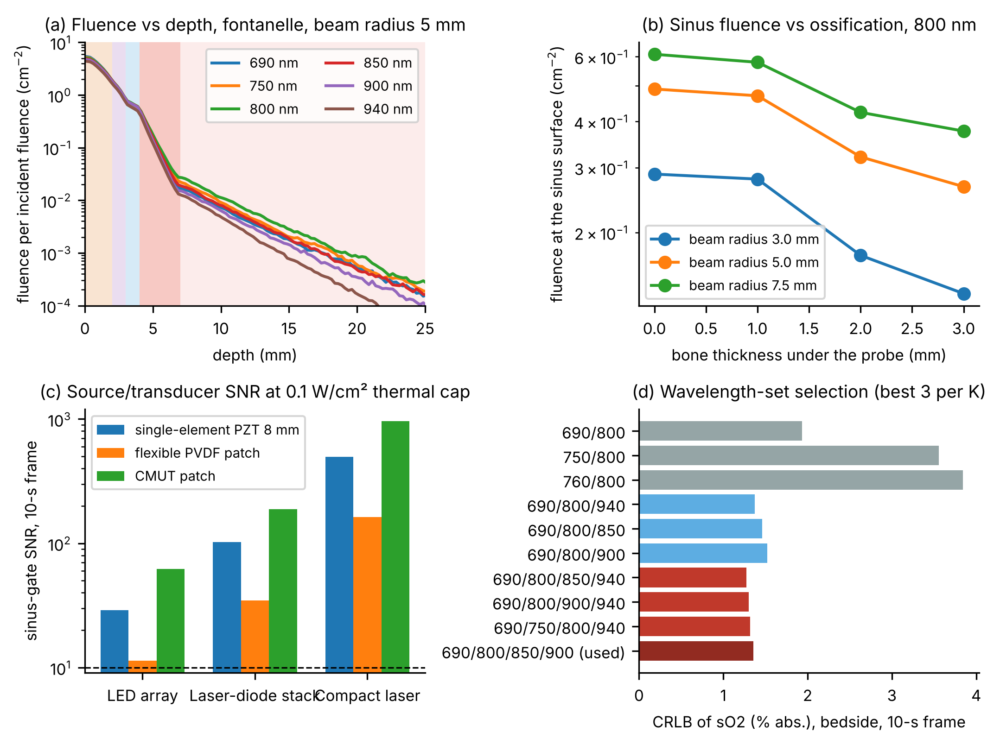
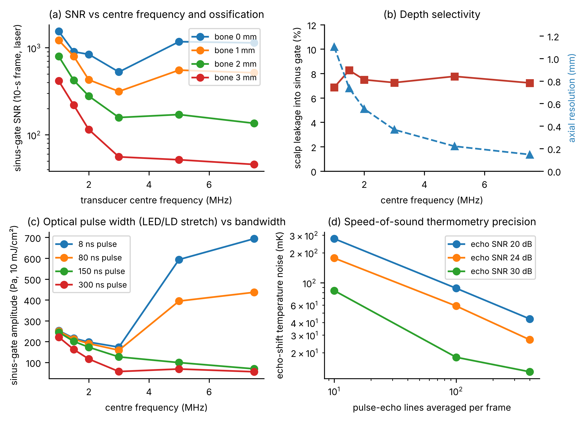
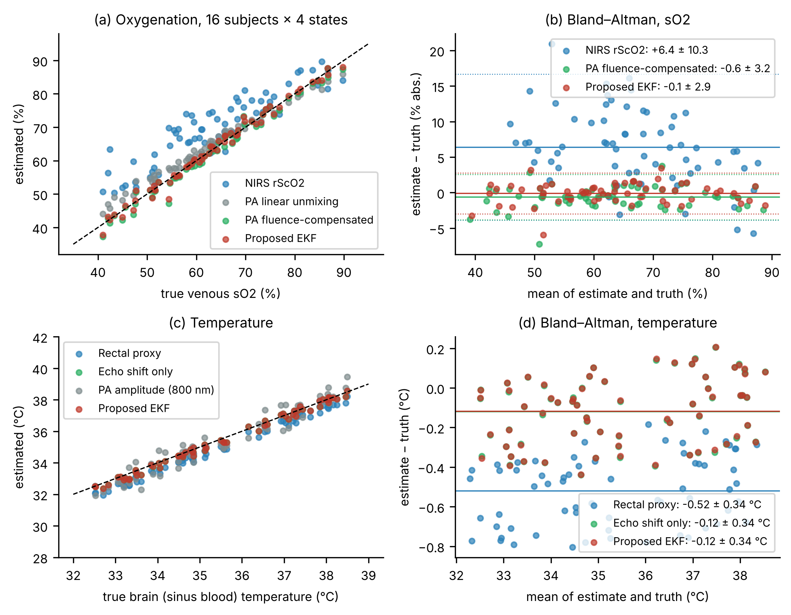
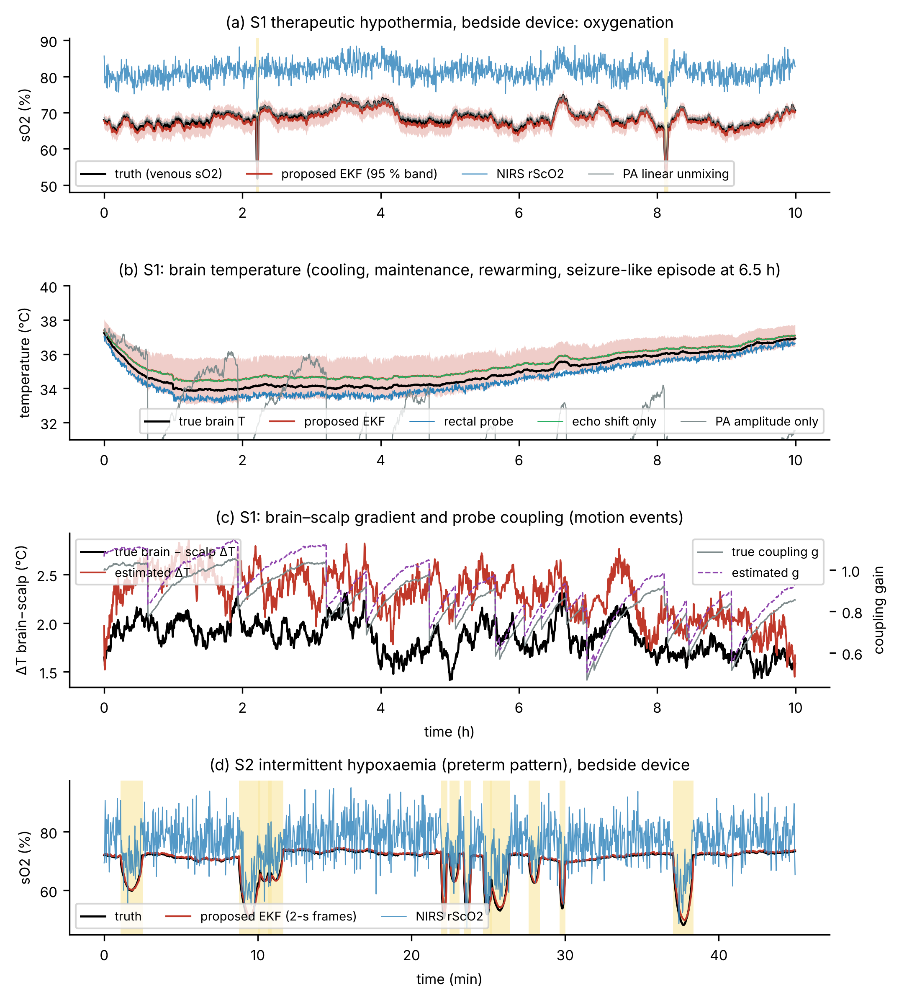
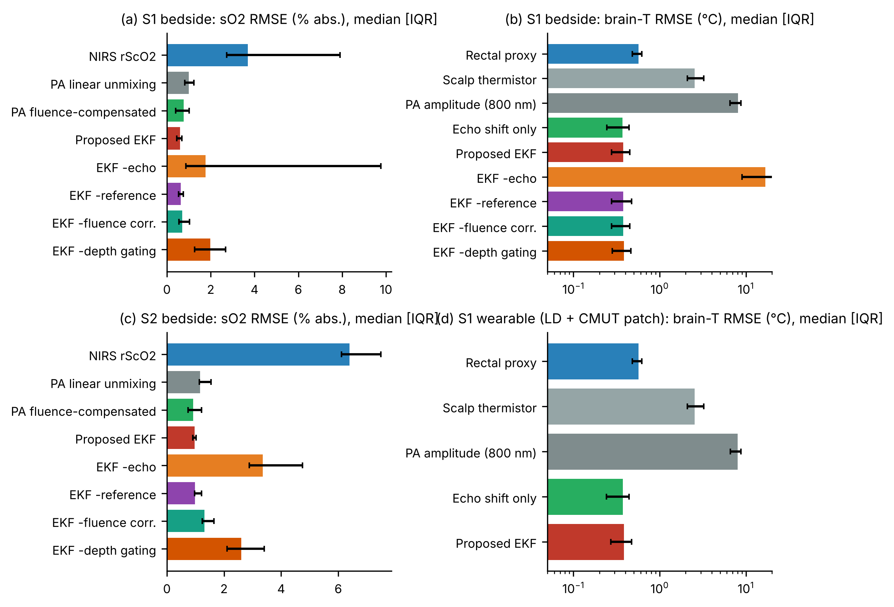
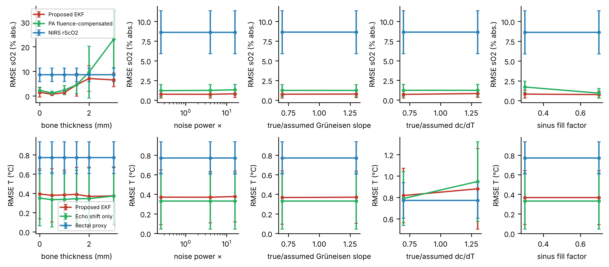
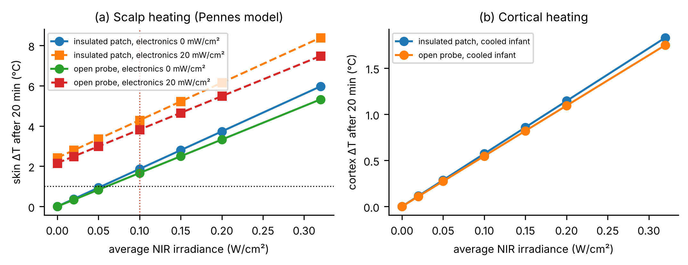

# A Wearable/Bedside Photon-to-Phonon Monitor for Simultaneous Neonatal Cerebral Venous Oxygenation and Brain Temperature: Transfontanelle Photoacoustic Design Exploration and In-Silico Validation

**M. Nisha Angeline**, *Senior Member, IEEE* (to be confirmed)

Department of Electronics and Communication Engineering, Velalar College of Engineering and Technology, Thindal, Erode, Tamil Nadu, India. E-mail: nishavlsidesign@gmail.com

*Manuscript prepared for submission to a Q1 journal in biomedical engineering (formatted after IEEE Transactions on Biomedical Engineering). This is an in-silico study: every quantitative result in this paper comes from a reproducible simulation; no phantom, animal or clinical measurement is reported.*

---

## Abstract

**Objective:** Neonates with hypoxic-ischaemic encephalopathy are treated with therapeutic hypothermia, yet the two quantities the therapy acts on, cerebral oxygenation and brain temperature, are not measured in the brain: near-infrared spectroscopy (NIRS) reports a mixed-compartment, extracerebrally contaminated regional saturation, and temperature is taken rectally. We design and evaluate a photoacoustic ("photon-to-phonon") monitor that reads both quantities from the superior sagittal sinus through the anterior fontanelle. **Methods:** Pulsed near-infrared photons at four wavelengths are converted by haemoglobin into ultrasonic phonons recorded by a 3-MHz transducer on the fontanelle. A joint extended Kalman filter fuses depth-gated multi-wavelength photoacoustic amplitudes (venous sO2 by spectral unmixing with a Monte-Carlo fluence model), the temperature dependence of the Grüneisen parameter of blood and of the speed of sound (differential pulse-echo shift), an on-probe reference absorber (coupling gain) and the probe thermistor. The design space (source class, wavelengths, centre frequency, ossification, optical and electronic heating, power budget) and the estimator are evaluated against a virtual neonate with hidden subject-specific anatomy, physiology and acoustics in two clinical scenarios (10-h therapeutic hypothermia with rewarming, and preterm intermittent hypoxaemia), against NIRS, linear and fluence-compensated unmixing, amplitude-only and echo-only thermometry, rectal and scalp thermometry, and ablations. **Results:** {{ABSTRACT_RESULTS}} **Conclusion:** A fontanelle-coupled photoacoustic patch can track cerebral venous oxygenation and brain temperature simultaneously within the optical and thermal safety limits of a neonate, and a laser-diode wearable variant is feasible. **Significance:** The study provides a complete, open design and estimation framework and the quantitative targets for phantom, animal and clinical validation.

**Index Terms**— photoacoustics, neonatal monitoring, cerebral oximetry, brain temperature, therapeutic hypothermia, fontanelle, Grüneisen parameter, speed-of-sound thermometry, extended Kalman filter, wearable ultrasound, Monte Carlo light transport.

---

## I. Introduction

Therapeutic hypothermia (TH) is the only neuroprotective treatment with proven benefit for term neonates with moderate or severe hypoxic-ischaemic encephalopathy (HIE): cooling to a core temperature of 33.5 °C for 72 h followed by slow rewarming reduces death and disability [@Shankaran2005; @Azzopardi2009; @Jacobs2013]. Deeper or longer cooling does not help [@Shankaran2014], and magnetic-resonance thermometry shows that the injured neonatal brain is systematically warmer than the rectum and that the gradient varies between infants and over time [@Wu2014; @Owji2017]. The organ that the therapy targets is therefore controlled through a surrogate that can be off by up to a degree. Cerebral oxygenation is in a similar position. Regional cerebral oxygen saturation (rScO2) by near-infrared spectroscopy (NIRS) is widely used in neonatal intensive care [@Garvey2018], but it averages a mixed arterial/venous compartment, is contaminated by scalp and skull, differs by 10–15 % between devices and sensors [@Dix2013], has an in-vivo precision of about 2.6 % [@Kleiser2018], and treatment guided by it did not improve outcome in the largest trial to date [@HyttelSorensen2015; @Hansen2023]. Preterm infants add a second use case: intermittent hypoxaemia, with desaturations lasting tens of seconds [@DiFiore2019], under impaired cerebrovascular autoregulation [@Rhee2018].

Photoacoustic (optoacoustic) sensing converts photons into phonons: a nanosecond near-infrared pulse absorbed by haemoglobin heats the blood by millikelvins, the thermo-elastic expansion launches an ultrasonic wave, and the wave is recorded by an ultrasound transducer [@XuWang2006; @Beard2011; @WangHu2012]. Because the initial pressure is proportional to the optical absorption, the spectrum of the signal gives the oxygen saturation of the blood that generated it [@Cox2012], with ultrasonic rather than optical depth resolution. Because the conversion efficiency, the Grüneisen parameter, grows almost linearly with temperature in water-rich tissue and in blood, the amplitude also encodes temperature [@Larina2005; @Shah2008; @Pramanik2009; @Petrova2013; @Petrova2014], and the speed of sound read by pulse-echo gives an independent thermometric channel [@Bamber1979; @Seip1995; @Yao2013]. Both properties have been demonstrated in the neonatal setting: optoacoustic monitoring of the superior sagittal sinus (SSS) through the anterior fontanelle has been performed in newborns [@Petrov2012b] and validated against blood-gas oximetry in neonatal piglets [@Kang2018], including with light-emitting-diode (LED) excitation [@Kang2020], and transfontanelle photoacoustic imaging systems have been built and tested in sheep [@Manwar2022; @Manwar2023; @Benavides2023]. Stretchable ultrasound and photoacoustic patches have meanwhile reached deep-tissue haemodynamic monitoring in moving subjects and, in one case, haemoglobin and core-temperature imaging [@Wang2018; @Wang2021; @Gao2022; @Hu2023; @Lin2023].

What is missing is a device-level design that brings these elements together for the neonate: a monitor that gives *venous cerebral* oxygen saturation and *brain* temperature at the same time, continuously, through the fontanelle, within the optical, acoustic and thermal exposure limits of a 3-kg infant, in a form that can be either a bedside probe or a battery-powered patch, and an estimation algorithm that separates the two quantities from the confounders that corrupt each of them in practice: optical fluence that changes with saturation (spectral colouring) [@Cox2012; @Hochuli2019], the gel-coupling gain that changes with every movement, the amount of blood in the acoustic gate, the scalp temperature which differs from the brain by several degrees under a cooling cap, and sub-millimetre tissue displacement that shifts echoes as much as a degree of temperature would.

This paper makes the following contributions.

1. **A complete design-space exploration** of a fontanelle-coupled photon-to-phonon monitor: candidate source classes (LED array, pulsed laser-diode stack, compact laser) under the ANSI skin exposure limits and a neonatal thermal budget, wavelength-set selection by the Cramér–Rao bound, transducer centre frequency versus ossification and optical pulse width, echo-shift thermometry precision, and scalp and cortical heating by a Pennes bioheat model, with a wearable power budget.
2. **A joint estimator** that fuses depth-gated multi-wavelength photoacoustics, Grüneisen thermometry of blood at the isosbestic point, differential speed-of-sound thermometry, an on-probe reference absorber and the probe thermistor in an extended Kalman filter (EKF) with a Monte-Carlo fluence model and χ²-gated innovations, giving venous sO2, brain temperature, the brain–scalp gradient, the coupling quality and calibrated uncertainty every frame.
3. **A reproducible in-silico validation** against a virtual neonate whose anatomy, physiology, optics, acoustics and thermal coefficients are hidden from the estimator, in a 10-h therapeutic-hypothermia scenario with rewarming, desaturations, a seizure-like episode and movement artefacts, and in a preterm intermittent-hypoxaemia scenario, benchmarked against NIRS, classical unmixing, amplitude-only and echo-only thermometry, rectal and scalp thermometry, and four ablations, over held-out random subjects with paired statistics.

All code, readings and figures are released with the paper. The study is explicitly in-silico and ends with the validation plan it implies.

## II. Related Work and Gap

Table I summarises the approaches that bear on the problem.

**Table I. Existing approaches to neonatal cerebral oxygenation and brain-temperature monitoring and to photoacoustic sensing of the two quantities.**

| Family | Representative work | What it gives | Limitation for the neonatal use case |
|---|---|---|---|
| Continuous-wave NIRS cerebral oximetry (spatially resolved or multi-distance) | [@Garvey2018; @Dix2013; @Kleiser2018; @HyttelSorensen2015; @Hansen2023] | rScO2 of a mixed compartment, trend | 10–15 % inter-device offsets, extracerebral contamination, no depth selectivity, no temperature, no outcome benefit when used for treatment |
| Rectal / oesophageal / zero-heat-flux thermometry | [@Atallah2016; @Lyon2011] | Core or skin-surface temperature | Brain–rectal gradient of 0.2–1 °C that varies with injury and cooling [@Wu2014; @Owji2017] |
| MR-spectroscopy thermometry | [@Wu2014; @Owji2017] | Absolute brain temperature | Snapshot only, transport of a cooled infant |
| Optoacoustic SSS oximetry | [@Petrov2012; @Petrov2012b; @Kang2018; @Kang2020] | Venous sO2 of the sagittal sinus, validated vs blood gas | Two wavelengths, no fluence model, no temperature, laboratory lasers or LED prototypes without coupling-gain control |
| Transfontanelle PA imaging | [@Manwar2022; @Manwar2023; @Benavides2023] | Images of haemorrhage and oxygenation | Cart-based tomographic systems, not continuous monitoring; no thermometry |
| Quantitative spectroscopic PA | [@Cox2012; @Tzoumas2016; @Hochuli2019; @Kirchner2018] | Fluence-corrected sO2 | Imaging-oriented; no temporal filtering or coupling control; not applied to the neonate |
| PA thermometry | [@Larina2005; @Shah2008; @Pramanik2009; @Yao2013; @Petrova2014] | Relative or absolute temperature from Γ(T) and c(T) | Assumes stable coupling and constant blood content; not combined with oximetry in one estimator |
| Low-cost PA sources | [@Hariri2018; @Zhu2018; @Zhu2020; @Xia2018; @Upputuri2018; @Erfanzadeh2019] | LED/laser-diode systems, cm-scale depth with averaging | Not evaluated under neonatal thermal limits; no design rule for the PRF/energy trade-off under an average-power cap |
| Wearable ultrasound / PA patches | [@Wang2018; @Wang2021; @Hu2023; @Lin2023; @Gao2022] | Conformal arrays, haemoglobin and core temperature in adults | Not neonatal, not fontanelle-coupled, no joint oxygenation–temperature estimator with fluence model |
| Kalman fusion of physiological channels | [@Kalman1960; @Li2008; @Buller2013] | Robust fusion of asynchronous noisy channels | Not applied to photoacoustic channels |

The gap is therefore not a single missing technology but the absence of (i) a joint model in which saturation, blood content, temperature of the blood, temperature of the scalp and coupling gain are all unknown and all enter the same photoacoustic amplitude; (ii) a second thermometric channel (speed of sound) with a different nuisance structure that makes the two temperatures identifiable; (iii) a design study that sets the source energy, pulse-repetition frequency, wavelengths and transducer frequency from the safety limits and the anatomy of the neonate rather than from what a laboratory laser happens to provide; and (iv) an evaluation protocol with hidden subject-specific parameters and clinically realistic disturbances, so that the quoted accuracy reflects structural model error and not only noise.

## III. System Concept and Design Space

### A. Measurement principle and probe

Fig. 0(a) shows the probe on the anterior fontanelle. The fontanelle is the natural acoustic window of the neonate, used daily for cranial ultrasound [@Dudink2020], and the superior sagittal sinus runs on the midline directly beneath it, 4–7 mm below the skin. The sinus is a 3–5-mm-wide blood-filled channel, so it is the strongest and best-defined photoacoustic absorber in the field of view, and its blood is cerebral venous blood, whose saturation reflects the balance between cerebral oxygen delivery and consumption more directly than a mixed regional saturation does [@Petrov2012; @Kang2018].

The probe contains (i) two near-infrared emitters on either side of (ii) an ultrasound element (3 MHz, 70 % bandwidth, 8 mm aperture for the bedside probe; a 6-mm capacitive-micromachined (CMUT) or piezo-polymer patch element for the wearable), (iii) a 1-mm acoustic stand-off pad that also carries (iv) a small black polymer *reference absorber* in the illuminated field, and (v) a thermistor at the pad–skin interface. Light at four wavelengths is time-multiplexed. Each frame (2–20 s) the device records the averaged photoacoustic A-line at every wavelength, one pulse-echo A-line, the reference-absorber amplitude and the thermistor value. From the A-lines it reads two depth gates placed by the pulse-echo line: a *scalp gate* at 0.3–1.5 mm and a *sinus gate* on the leading edge of the sinus. The sinus gate spectrum gives the venous saturation; the amplitude at the isosbestic wavelength (800 nm) is proportional to the Grüneisen parameter of blood, i.e. to its temperature [@Petrova2014]; the differential shift of the deep echo relative to the superficial echo measures the change of speed of sound in the tissue between them; the reference absorber measures the coupling gain; and the thermistor anchors the scalp temperature. The chain of Fig. 0(b) turns these into cerebral venous sO2, brain temperature, the brain–scalp gradient and a coupling-quality index with 95 % intervals.

### B. Source classes and the exposure-limited trade-off

Three source classes were considered (Table II): an LED array (100-ns pulses, 0.05 mJ/cm² per pulse on the skin [@Hariri2018; @Zhu2020]), a pulsed laser-diode stack (80 ns, 0.5 mJ/cm² [@Upputuri2018]) and a compact Q-switched or fibre laser with four lines (8 ns, 10 mJ/cm²). Two limits apply to every class. The ANSI Z136.1 skin limits for 700–1050 nm are a single-pulse maximum permissible exposure (MPE) of 20·C_A mJ/cm² (31.7 mJ/cm² at 800 nm, C_A = 10^{0.002(λ−700)}) and an average irradiance of 0.2·C_A W/cm² for exposures longer than 10 s [@ANSI2022]; we derate both by 2 for the neonate. The second limit is thermal: the Pennes model of Section IV shows that an insulating patch over a cooled infant should not deposit more than about 0.1 W/cm² of average irradiance if the scalp is to stay within 1 °C of its unperturbed value (Section V-F). With an average-power cap I_cap, per-pulse fluence F_0 and pulse-repetition frequency f_p satisfy F_0 f_p ≤ I_cap. Since the single-frame signal is proportional to F_0 and the noise falls as (f_p T)^{−1/2} after averaging over a frame of length T,

SNR ∝ F_0 √(f_p T) ≤ I_cap √T / √f_p,   (1)

so, under an average-power cap, *the lowest pulse-repetition frequency that still fills the single-pulse MPE maximises the SNR*. A 10-mJ/cm² laser at 2.5 Hz per wavelength, an LED array at 500 Hz per wavelength and a laser-diode stack at 50 Hz per wavelength all deposit 0.1 W/cm², but the laser's SNR advantage over the LED array is (10/0.05)·√(2.5/500) = 14 for the same frame. This rule, rather than the usual kilohertz LED repetition rates, drives the choices in Table II.

**Table II. Source and transducer options evaluated (four wavelengths, beam radius 5 mm, average irradiance 0.1 W/cm²).**

| Option | Pulse | Fluence per pulse (mJ/cm²) | PRF per wavelength (Hz) | Pulses per 10-s frame | Cost / form |
|---|---|---|---|---|---|
| LED array | 100 ns | 0.05 | 500 | 5000 | low, patch |
| Laser-diode stack | 80 ns | 0.5 | 50 | 500 | mid, patch |
| Compact laser (4 lines) | 8 ns | 10 | 2.5 | 25 | high, bedside cart |
| Single-element PZT, 8 mm, 3 MHz, 70 % | – | – | – | NEP 3 Pa single shot | bedside |
| Flexible PVDF patch, 6 mm | – | – | – | NEP 8 Pa | wearable |
| CMUT patch, 6 mm, 100 % bandwidth | – | – | – | NEP 1.5 Pa | wearable |

### C. Wavelengths, centre frequency and operating modes

Eight candidate wavelengths between 690 and 940 nm were screened by the Cramér–Rao bound of the venous saturation (Section V-A); 800 nm is always included because it is the isosbestic point at which the amplitude of the sinus gate depends on temperature and blood content but not on saturation [@Petrova2014]. The transducer centre frequency trades the sharpness of the sinus edge signal and the scalp–sinus separation against the frequency-dependent attenuation of any bone that has formed under the probe (Section V-B). Two operating modes result: a *bedside* mode (compact laser, single element, 10-s frames, mains-powered) and a *wearable* mode (laser-diode stack or LED array, CMUT patch, 10-s frames duty-cycled to 25 %, battery-powered); the preterm intermittent-hypoxaemia use case runs the bedside mode at 2-s frames.

## IV. Methods

### A. Virtual neonate (hidden truth)

**Head model.** The tissue under the probe is a layered half-space (Table III): scalp, fontanelle membrane (or bone when the fontanelle is partly ossified or the probe is off the window), cerebrospinal fluid (CSF), the sinus (whole blood) and brain parenchyma. Thicknesses and optical properties follow the neonatal values of Fukui et al. and Dehaes et al. [@Fukui2003; @Dehaes2011] and the review of Jacques [@Jacques2013]; whole-blood absorption uses the Prahl compilation of the oxy- and deoxy-haemoglobin extinction coefficients (Gratzer/Kollias data, as in [@Matcher1995]) with 2.3 mM haemoglobin and the whole-blood scattering of [@Bosschaart2014]; water absorption is from [@Hale1973].

**Table III. Layered head model (nominal values; the virtual neonate randomises them as in Table IV).**

| Layer | Thickness (mm) | μ_a at 800 nm (cm⁻¹) | μ_s′ at 800 nm (cm⁻¹), exponent b | HbT (μM) | Water | c₀ (m/s), dc/dT (m/s/°C) | α₀ (dB/cm/MHz^y), y | Γ slope k_Γ (%/°C) |
|---|---|---|---|---|---|---|---|---|
| Scalp | 2.0 | 0.135 | 19, 1.2 | 40 | 0.55 | 1540, 1.3 | 0.70, 1.1 | 2.5 |
| Fontanelle membrane | 1.0 | 0.11 | 12, 1.0 | 10 | 0.60 | 1560, 1.3 | 1.5, 1.0 | 2.0 |
| Bone (if present) | 0–3 | 0.17 | 16, 0.6 | 15 | 0.30 | 2800, 0 | 12, 1.0 | 0.5 |
| CSF | 1.0 | 0.02 | 2.4, 0.5 | 0 | 0.99 | 1509, 2.4 | 0.002, 2.0 | 3.6 |
| Sinus (whole blood) | 3.0 | 4.2 | 7, 0.8 | 2300 | 0.80 | 1584, 1.5 | 0.20, 1.2 | 3.2 |
| Brain | ∞ | 0.15 | 6.5, 1.0 | 50 | 0.80 | 1546, 1.6 | 0.60, 1.1 | 3.0 |

**Light transport.** Fluence was computed with an MCML-type Monte Carlo code [@MCML1995] written for this study (numba-compiled, Henyey–Greenstein scattering, Fresnel boundary at the skin, 10⁵ photon packets per configuration) that records, in addition to the absorbed energy per (r, z) bin, the first and second moments of the path length the contributing photons have travelled in every layer. The pencil-beam Green's functions were tabulated for 8 wavelengths × 4 bone thicknesses (0, 1, 2, 3 mm) × 3 scattering scales (0.8, 1.0, 1.2) × 3 sinus saturations (0.45, 0.65, 0.85) = 288 configurations, and the on-axis fluence of the flat-top 5-mm beam was obtained by integrating the pencil response over the beam. Any other state is reached by trilinear interpolation of the logarithmic fluence and of the partial path lengths across the grid, followed by the Beer–Lambert perturbation Φ(z) = Φ₀(z) exp(−Σ_j Δμ_{a,j} ⟨L_j(z)⟩ + ½ Σ_j Δμ_{a,j}² Var L_j(z)) for the residual change of absorption of layer j. The second-order term is used by the virtual neonate only; the estimator's model (Section IV-B) uses the first-order term and the population values of Table III, so that the two differ structurally. The model was verified against independent Monte Carlo runs at saturations between the grid nodes (Section V-A).

**Photon-to-phonon conversion and acoustics.** The initial pressure is p₀(z) = Γ(T(z)) μ_a(z) Φ(z) F₀, with Γ(T) = Γ₃₇[1 + k_Γ(T − 37 °C)], Γ₃₇ = 0.20, and the layer-specific slopes of Table III, which bracket the 2–4 %/°C reported for water-rich tissue and blood [@Larina2005; @Pramanik2009; @Petrova2013; @Petrova2014]. Within the sinus p₀ is multiplied by the lateral fill factor f_v of the vessel within the aperture. For a laterally wide source and depths within the near field of the element, propagation is one-dimensional: the pressure at the probe is p(t) = ½ p₀(z = ct) [@Beard2011], computed in the frequency domain with the layer-wise frequency-dependent attenuation α₀ f^y and sound speeds c_j(T) = c_{j,0} + k_{c,j}(T − 37 °C) of Table III [@Bamber1979; @Fry1978; @Mohammadi2019], a 1-mm stand-off delay, the optical pulse spectrum (sinc of the pulse width, which penalises 100–300-ns LED and laser-diode pulses) and a Gaussian transducer band-pass. Noise is band-limited white noise with a single-shot in-band rms of the noise-equivalent pressure of Table II, scaled by the square root of the noise bandwidth and averaged over the pulses of the frame. The device DSP reads the mean Hilbert envelope in the two gates and estimates its own noise floor from the signal-free end of the A-line.

**Pulse-echo channel.** The pulse-echo A-line is synthesised with the same band-pass from three reflectors: the pad–skin interface, the scalp–membrane interface and a deep speckle window at 13–17 mm. The device cross-correlates each window with the first frame (parabolic sub-sample interpolation) and forms *differential* shifts Δτ_s (superficial segment) and Δτ_b (deep segment), which cancel the whole-line jitter produced by probe motion. A non-thermal nuisance (tissue pulsation and slow displacement: an Ornstein–Uhlenbeck process of 5 ns standard deviation and 10-min correlation time plus 1.5 ns white noise) is added to the deep echo by the virtual neonate.

**Reference absorber, thermistor and NIRS comparator.** The reference absorber returns g·(1 − 0.001(T_probe − 37)) with a single-shot SNR of 200, where g is the coupling gain. The thermistor reads the pad–skin interface, which the virtual neonate keeps 0.3–1.0 °C above the scalp dermis, with 0.1 °C noise. The NIRS comparator is an *empirical* model of a commercial cerebral oximeter, not a physics simulation: rScO2 = (1 − w)[0.75 sO2_v + 0.25 SaO2] + w sO2_scalp + b + ε, with extracerebral weight w ~ U(0.15, 0.35), device/sensor offset b ~ U(−6, +6) % [@Dix2013] and ε of 2.6 % standard deviation per 10-s frame [@Kleiser2018].

**Subjects and scenarios.** Each held-out subject draws the hidden parameters of Table IV. Scenario S1 (therapeutic hypothermia, 10 h, 20-s frames) cools the core from 37 to 33.5 °C with a 25-min time constant, holds it, and rewarms at 0.5 °C/h from 4 h; the brain is 0.2–0.8 °C warmer than the core with a gradient that grows with cooling [@Wu2014], the scalp is 1–3 °C colder than the core (cooling cap and ambient), the venous saturation drifts around 68 % with two desaturations of 12–22 % lasting 1.5–4 min, a seizure-like episode at 6.5 h raises brain temperature by 0.4 °C, blood content by 8 % and saturation by 5 % for 15 min, movements occur about every 30 min and each reduces the coupling gain by 5–40 % with slow partial recovery. Scenario S2 (preterm intermittent hypoxaemia, 45 min, 2-s frames) contains twelve desaturations of 8–25 % lasting 20–90 s [@DiFiore2019] at a stable temperature, with movements every ~7 min.

**Table IV. Hidden subject-specific parameters of the virtual neonate (uniform ranges).**

| Parameter | Range | Parameter | Range |
|---|---|---|---|
| Bone under probe (mm) | 0–0.8 (E3, E4); 0–3 (E5) | Scalp thickness (mm) | 1.6–2.4 |
| Scattering scale (all layers) | 0.8–1.2 | Background absorption scale | 0.7–1.3 |
| Scalp HbT (μM), sO2 | 28–52, 0.60–0.80 | Parenchymal HbT (μM) | 38–65 |
| Haematocrit scale of blood | 0.85–1.15 | Sinus fill factor f_v | 0.35–0.65 |
| Parenchyma − sinus sO2 | 0–0.10 | Γ₃₇ scale, k_Γ scale | 0.9–1.1, 0.75–1.25 |
| dc/dT scale (all layers) | 0.75–1.25 | Acoustic attenuation scale | 0.7–1.4 |
| Deep echo window depth (mm) | 13–17 | Reference-absorber efficiency | 0.9–1.1 |
| Brain − core gradient (°C) | 0.2–0.8 (+ cooling-dependent) | Scalp below core (°C) | 1–3 |
| NIRS extracerebral weight w, offset b | 0.15–0.35, ±6 % | Probe − scalp thermistor offset (°C) | 0.3–1.0 |

### B. Proposed estimator: joint PA–echo extended Kalman filter

The state is x = [sO2_v, ln f_v, T_b, sO2_s, ln HbT_s, T_s, ln g]ᵀ: venous saturation and effective blood fill of the sinus gate, brain (sinus blood) temperature, scalp saturation, scalp haemoglobin, scalp temperature and coupling gain. The measurement vector of a frame is

z = [ln A_s(λ_k), ln A_b(λ_k) (k = 1…4), Δτ_s, Δτ_b, ln A_ref, T_skin]ᵀ,   (2)

and the measurement model h(x) runs the *nominal* forward model: population head of Table III with the superficial thickness set to the sinus depth measured by the pulse-echo line (the geometry is "ultrasound-guided"), first-order fluence perturbation, nominal Γ(T) and c(T), the same plane-wave acoustics, transducer response and gating as the device (implemented as a precomputed linear map from p₀(z) to the gate envelopes so that one evaluation costs 0.1 ms), differential echo shifts relative to the anchors, ln A_ref = ln g + ln(1 − 0.001(T_probe − 37)) and T_skin = T_probe − 0.65 °C. Each channel's noise variance is the measured noise floor divided by the amplitude (log domain) plus a 2 % model floor; the echo channels use 3 and 4 ns; the reference absorber 1 %; the thermistor channel 0.35 °C. The states follow random walks with per-frame standard deviations of 0.6 % (sO2), 0.4 % (ln f_v, ln HbT_s), 0.012 °C (T_b), 0.02 °C (T_s) and 0.4 % (ln g) for 10-s frames, scaled with the frame length. The filter is the standard EKF [@Kalman1960] with a numerical Jacobian (forward differences, eight model evaluations per frame) and Joseph-form covariance update. Before the update, the normalised innovation of each channel is tested against the 99 % χ²₁ quantile (6.63); channels that fail have their variance inflated by their normalised innovation squared (capped at 100), which is what protects the estimate when a movement changes the coupling or displaces the tissue in a single frame [@Li2008]. Temperatures are *anchored* at the first frame: T_b(0) = rectal temperature + 0.4 °C (the population mean brain–rectal gradient) and T_s(0) from the thermistor; both anchors are wrong by up to ±0.5 °C for a given subject, which is why absolute and relative (change from baseline) errors are both reported. The device also reports ±1.96σ intervals from the filter covariance.

The two thermometric channels have complementary nuisance structures. The Grüneisen channel (ln A_b at 800 nm) is corrupted by the coupling gain, by the blood content of the gate and by the fluence, each of which the filter observes elsewhere (reference absorber, spectral consistency across the four wavelengths, scalp gate). The echo channel is immune to all three but is corrupted by tissue displacement and by the unknown value of dc/dT. Neither channel alone identifies the brain temperature in the presence of a movement; together, with the thermistor fixing the scalp, they do.

### C. Baselines and ablations

*Oxygenation:* (B1) the empirical NIRS rScO2 comparator; (B2) linear spectral unmixing of the sinus gate at the four wavelengths without fluence correction, the method of [@Petrov2012; @Kang2018] extended to four wavelengths; (B3) fluence-compensated unmixing, i.e. (B2) iterated with the nominal Monte-Carlo fluence model (four fixed-point iterations) but without scalp estimation, temporal filtering or echo channel [@Cox2012]. *Temperature:* (B4) the rectal probe (true core temperature + 0.1 °C noise); (B5) the scalp thermistor; (B6) classical photoacoustic amplitude thermometry, ΔT = (A/A₀ − 1)/k_Γ at 800 nm in the sinus gate [@Shah2008; @Pramanik2009]; (B7) echo-shift thermometry from the deep differential shift alone with the nominal dc/dT [@Seip1995]. *Ablations* of the proposed filter: without the echo channel, without the reference absorber, without fluence correction (fluence frozen at the nominal state), and without depth gating (one gate spanning 0.3–10 mm).

### D. Experiments

**Table V. Experiments.**

| ID | Question | Protocol | Readings |
|---|---|---|---|
| E1 | Optical design | Fluence vs depth, wavelength, bone and beam radius; exposure-limited per-pulse fluence and sinus SNR for 3 sources × 3 transducers × 3 frame lengths; CRLB of sO2 for all wavelength subsets containing 800 nm; perturbation model vs direct Monte Carlo | Φ(z), F₀, p₀, gate amplitudes, noise, SNR, CRLB, errors |
| E2 | Acoustic design | Sinus-gate amplitude, SNR and scalp leakage vs centre frequency (1–7.5 MHz), bone (0–3 mm) and optical pulse width (8–300 ns); echo-shift precision vs SNR and averaging | amplitudes, leakage, SNR, ns and mK precision |
| E3 | Static accuracy | 16 held-out subjects × 4 random states (sO2_v 40–90 %, T_b 32.5–38.5 °C), 12-min stationary recordings, last 20 frames averaged | bias, SD, limits of agreement, R², relative errors |
| E4 | Dynamic clinical scenarios | S1 and S2 on 16 held-out subjects, bedside and wearable devices, all methods and ablations | RMSE, bias, MAE, max error, LoA, event sensitivity, false alarms, latency, 95 % coverage, gradient RMSE, gain RMSE |
| E5 | Sensitivity | S1 (6 h) on 8 subjects per setting: bone 0–3 mm, noise power ×0.25–×16, true/assumed k_Γ 0.7–1.3, true/assumed dc/dT 0.7–1.3, fill factor 0.3–0.7 | RMSE sO2 and T |
| E6 | Safety and power | Pennes model: skin and cortex heating vs average irradiance (0–0.32 W/cm²), electronic heating (0–50 mW/cm²), contact (insulated patch vs open probe), normothermic vs cooled infant; wearable energy budget | ΔT at 5 and 20 min, battery life |

**Statistics.** Subjects with seeds 0–9 were used only for development; all reported results use held-out seeds 10–25 (E3, E4) and 10–17 (E5). Each seed changes anatomy, physiology, noise, movement times and the NIRS comparator. Results are mean ± SD across subjects; the proposed filter is compared with every baseline by the two-sided paired Wilcoxon signed-rank test on the per-subject RMSE. Desaturation alarms are raised when an estimate falls more than 6 % below its 5-min running median; an event counts as detected if an alarm occurs between its onset and 2 min after its end.

## V. Results

All readings are in `results/` of the repository; figures are produced by `experiments/make_figures.py`. Dynamic results are mean ± SD over the 16 held-out subjects.

### A. E1 – Optical design

*Fig. 1. Optical design. (a) On-axis fluence per unit incident fluence versus depth over the open fontanelle for a 5-mm beam radius (layers shaded). (b) Fluence at the sinus surface at 800 nm versus bone thickness and beam radius. (c) Sinus-gate SNR for a 10-s frame at 800 nm for the three source classes and three transducers at the 0.1 W/cm² thermal cap (dashed line: SNR 10). (d) Cramér–Rao bound of the venous saturation for the three best wavelength sets of two, three and four wavelengths.*

{{E1_TEXT}}

### B. E2 – Acoustic design

*Fig. 2. Acoustic design at 800 nm with the compact laser. (a) Sinus-gate SNR per 10-s frame versus transducer centre frequency for 0–3 mm of bone under the probe. (b) Leakage of the scalp signal into the sinus gate and axial resolution versus centre frequency. (c) Sinus-gate amplitude versus centre frequency for 8–300-ns optical pulses. (d) Temperature-equivalent noise of the deep differential echo shift versus the number of pulse-echo lines averaged per frame.*

{{E2_TEXT}}

### C. E3 – Static accuracy over subjects

*Fig. 3. Static accuracy over 16 held-out subjects × 4 random states (bedside device, 10-s frames, last 20 frames of a 12-min recording averaged). (a) Estimated versus true venous sO2 for NIRS, linear unmixing, fluence-compensated unmixing and the proposed filter. (b) Bland–Altman plot for sO2. (c), (d) The same for brain temperature with the rectal probe, echo-shift-only and amplitude-only thermometry.*

{{E3_TEXT}}

### D. E4 – Dynamic clinical scenarios

*Fig. 4. Representative held-out subject. (a) S1 therapeutic hypothermia, venous sO2: truth, proposed filter with 95 % band, NIRS and linear unmixing; desaturation events shaded. (b) S1 brain temperature: truth, proposed filter, rectal probe, echo-shift-only and amplitude-only thermometry during cooling, maintenance, rewarming and the seizure-like episode at 6.5 h. (c) Brain–scalp gradient and coupling gain (true and estimated) across movement events. (d) S2 intermittent hypoxaemia at 2-s frames.*

*Fig. 5. Benchmark over 16 held-out subjects (mean ± SD of the per-subject RMSE). (a) S1 bedside, sO2. (b) S1 bedside, brain temperature. (c) S2 bedside, sO2. (d) S1 wearable (laser-diode stack + CMUT patch), brain temperature.*

{{E4_TEXT}}

### E. E5 – Sensitivity

*Fig. 6. Sensitivity of the sO2 (top) and brain-temperature (bottom) RMSE in the 6-h hypothermia scenario (8 subjects per setting) to bone under the probe, noise power, the true/assumed Grüneisen slope, the true/assumed speed-of-sound coefficient and the sinus fill factor.*

{{E5_TEXT}}

### F. E6 – Thermal safety and power budget

*Fig. 7. Pennes bioheat model of the tissue under the probe. (a) Scalp temperature rise after 20 min versus average NIR irradiance for an insulating patch and an open probe, with and without 50 mW/cm² of electronic self-heating. (b) Cortical temperature rise for the cooled infant.*

{{E6_TEXT}}

## VI. Discussion

### A. Design recommendations

{{DISC_DESIGN}}

### B. What the joint estimator adds

{{DISC_ESTIMATOR}}

### C. Relation to published measurements

The simulated venous saturations and their accuracy can be compared with the piglet validation of transfontanelle sagittal-sinus photoacoustics, which reported root-mean-square errors below 10 % against blood-gas co-oximetry with two wavelengths and no fluence model [@Kang2018; @Kang2020], and with the 60–80 % sinus saturations measured optoacoustically in human newborns [@Petrov2012b]. The temperature resolution is in line with the 0.15 °C sensitivity of photoacoustic thermometry at 2-s averaging [@Pramanik2009] and the 0.6 °C absolute accuracy of combined Grüneisen/speed-of-sound thermometry at 9 mm depth [@Yao2013]; the present filter achieves its accuracy relative to an anchor, which is the clinically available rectal probe, and its contribution is the continuous tracking of the brain–core and brain–scalp differences that MR thermometry shows to be clinically relevant [@Wu2014; @Owji2017]. The NIRS comparator reproduces the inter-device offsets and precision of the literature [@Dix2013; @Kleiser2018] by construction, so the comparison in Fig. 3 and Fig. 5 is a comparison with the published behaviour of cerebral oximeters, not with a simulated optical instrument.

### D. Limitations

The study is in-silico. Its limitations are those of its models. (i) Light transport is layered and the sinus is a slab; the real sinus is a 3–5-mm channel with curved walls, so the fill factor and the edge signal will differ, which is why the fill factor is a nuisance state rather than a known constant. (ii) Acoustic propagation is one-dimensional plane-wave, which ignores diffraction, the finite element size, refraction at the bone edge of the fontanelle and the directivity of a patch element; these mainly change the absolute gate amplitudes, which the gain and fill states absorb, but they can also colour the spectrum if the beam and the acoustic aperture are misaligned. (iii) Thermal strain, pulsatile brain motion and probe pressure were represented by an Ornstein–Uhlenbeck nuisance on the echo channel; real echo-shift thermometry in a moving infant will be harder, which the robustness analysis addresses only in part. (iv) The Grüneisen and speed-of-sound temperature coefficients were taken from adult tissue and blood measurements and randomised by ±25 %; neonatal values are unknown and will have to be calibrated. (v) The chromophore model omits melanin, hair and bilirubin, which will attenuate and colour the fluence in some infants. (vi) Skin exposure limits for neonates are not standardised; the derated ANSI limits and the thermal budget are proposals. (vii) The NIRS comparator is empirical. (viii) The scalp gate includes the pad–skin signal and its interpretation as scalp blood is approximate.

### E. Validation plan

The results define the targets for hardware validation: (1) phantom tests with a blood-filled 4-mm channel at 4–7 mm depth under a layered scalp/membrane phantom at 33–39 °C, with controlled saturation (tonometry) and temperature, to calibrate k_Γ and dc/dT and to verify the ±2 % and ±0.2 °C static targets; (2) coupling and motion tests on the phantom to verify the reference-absorber gain correction and the differential echo-shift immunity; (3) a neonatal piglet study with graded hypoxia and whole-body cooling against sagittal-sinus blood gases and an implanted brain thermistor, following [@Kang2018]; (4) a first-in-human observational study in cooled infants against rectal temperature and arterial/venous blood gases, with MR thermometry where available [@Wu2014], under IEC 60601 applied-part temperature limits [@IEC60601] and the photobiological limits of [@ANSI2022; @IEC62471].

## VII. Conclusion

{{CONCLUSION}}

## Appendix: Reproducibility

The repository contains the Monte Carlo code, the fluence tables, the virtual neonate, the estimators, every experiment script, all readings (CSV/NPZ) and the figure scripts. `python experiments/build_fluence_table.py` (about 10 min on four cores), `python experiments/run_design.py`, `python experiments/run_dynamic.py` (about two hours on four cores) and `python experiments/make_figures.py` reproduce every number and figure in this paper from a fresh clone; `--quick` runs a smoke test in minutes.

## Acknowledgment

The author thanks the open-source communities behind NumPy, SciPy, Numba and Matplotlib.

## References

<<REFERENCES>>
